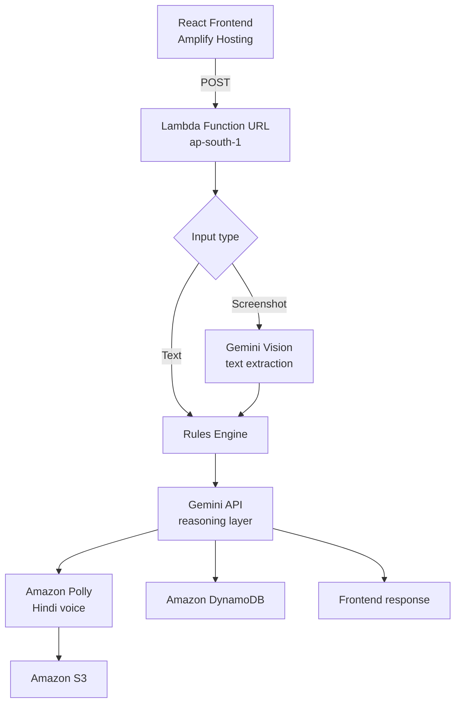

# Raksha — AI-Powered Scam Detection in Hindi

**Built for First Commit — AWS x WeMakeDevs Bharat Builds Tour, Sept 2026**

Raksha analyzes suspicious messages, call recordings, or screenshots and
tells you — in Hindi, with voice — whether it's a scam, why, and what to
do next, including a ready-to-file police complaint draft.

🔗 **Live app:** https://main.d2p4215h3yx9ec.amplifyapp.com
🎥 **Demo video:** https://youtu.be/405M8XaA4NE?si=SobH_JpG4MdFeYuI
📝 **Blog:** https://builder.aws.com/content/3JaXJDoVJjDmIQnKzN894bvUFUb/raksha

## The problem

Digital Arrest scams, fake customs seizures, UPI refund fraud, and loan-app
harassment target Indians daily, exploiting panic and unfamiliarity with
legal procedure. There's no fast way for someone mid-call to check if it's
real. Raksha is that check.

## What it does

1. Paste a message, or upload a screenshot of a suspicious chat
2. A deterministic rules engine scores it against known scam signals
   (urgency, authority claims, secrecy demands, shortlinks, UPI requests,
   explicit threats)
3. An AI agent reasons over the content and a library of known Indian
   scam playbooks
4. Returns: verdict, confidence, Hindi voice explanation, red flags,
   next steps, and an NCRP-format complaint draft ready to file

## Architecture



## Stack

| Layer | Technology |
|---|---|
| Frontend | React (Vite), deployed on AWS Amplify Hosting |
| Backend | AWS Lambda (Python 3.12), Function URL |
| Reasoning + vision | Google Gemini API |
| Text-to-speech | Amazon Polly (Hindi, neural) |
| Database | Amazon DynamoDB |
| Storage | Amazon S3 |
| Infra as code | AWS SAM |

## Real engineering trade-offs

**Bedrock → Gemini:** Originally built on Amazon Bedrock (Nova Pro).
Bedrock's Converse API returned a persistent `ValidationException:
Operation not allowed` from the Lambda execution role — even with full
Bedrock + Marketplace IAM permissions, despite the same call succeeding
from an authenticated CLI user. Rather than lose hours to an unresolved
account-level restriction, we swapped the reasoning layer to Gemini,
keeping every other component on AWS.

**Textract → Gemini Vision:** Screenshot text extraction was originally
built on Amazon Textract, which returned `SubscriptionRequiredException`
on this account. Swapped to Gemini's vision input for the same task,
simplifying the pipeline by one fewer AWS dependency.

Both trade-offs are documented here rather than hidden, since they're
real decisions made under a real deadline.

## Local setup

```bash
git clone https://github.com/rajputpranav611-byte/AWS-FIRST-COMMIT.git
cd AWS-FIRST-COMMIT/raksha
python -m venv .venv && .venv\Scripts\activate
pip install -r src/requirements.txt
sam build
sam deploy --guided --parameter-overrides GeminiApiKey=<your-key>

cd web
npm install
npm run dev
```

## AI tools used

- Google Gemini API (gemini-3.6-flash) — reasoning and vision layer
- AI-assisted coding (IDE agent) for scaffolding and iteration

## Team

[Your name] — [University name]

## License

MIT
